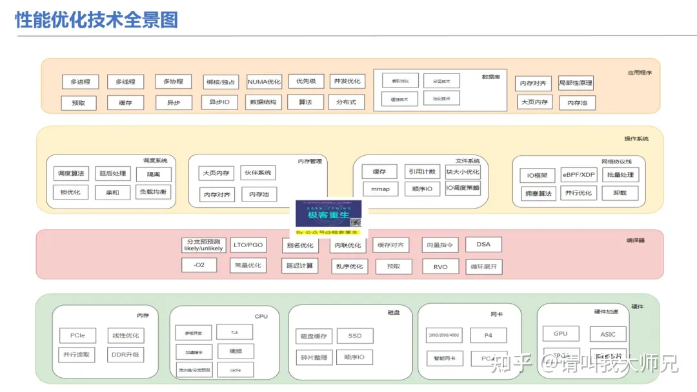
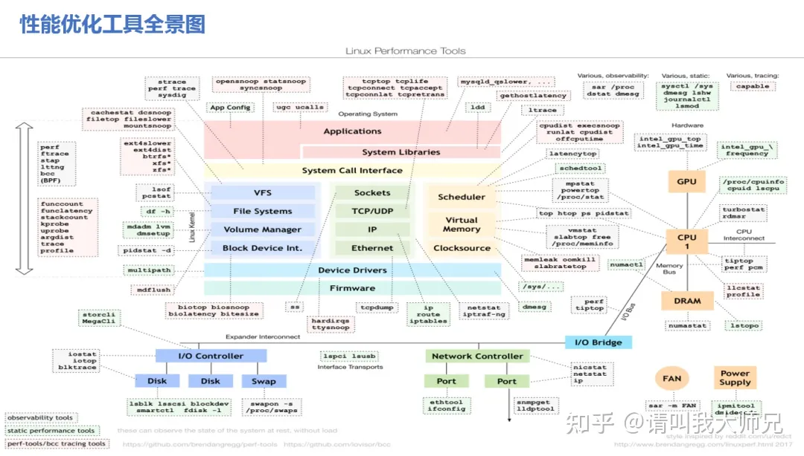
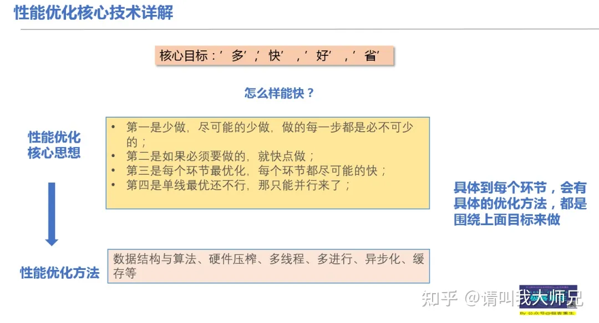
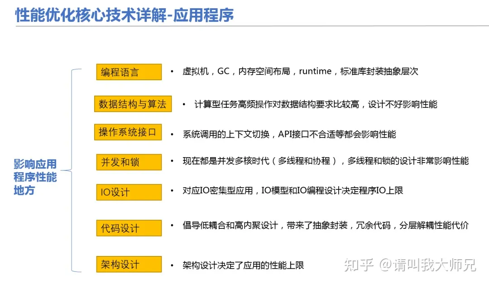

本文为摘录网络内容. 由于时间原因未记录原文地址，谷歌即可找到原文。

## 简述数据库三大范式
第一范式是最基本的范式。如果数据库表中的所有字段值都是不可分解的原子值，就说明该数据库表满足了第一范式。

数据库第二范式：关系模式必须满足第一范式，并且所有非主属性都完全依赖于主码。注意，符合第二范式的关系模型可能还存在数据冗余、更新异常等问题。关系模型（学号，姓名，专业编号，专业名称）中，学号->姓名，而专业编号->专业名称，不满足数据库第二范式

数据库第三范式：关系模型满足第二范式，所有非主属性对任何候选关键字都不存在传递依赖。即每个属性都跟主键有直接关系而不是间接关系。接着以学生表举例，对于关系模型（学号，姓名，年龄，性别，所在院校，院校地址，院校电话）院校地址，院校电话和学号不存在直接关系，因此不满足第三范式。

## 简述MySQL的架构
MySQL可以分为应用层,逻辑层,数据库引擎层,物理层。

应用层：负责和客户端，响应客户端请求，建立连接，返回数据。

逻辑层：包括SQK接口，解析器，优化器，Cache与buffer。

数据库引擎层：有常见的MyISAM,InnoDB等等。

物理层：负责文件存储，日志等等。

## 简述执行SQL语言的过程
客户端首先通过连接器进行身份认证和权限相关
如果是执行查询语句的时候，会先查询缓存，但MySQL 8.0 版本后该步骤移除。
没有命中缓存的话，SQL 语句就会经过解析器，分析语句，包括语法检查等等。
通过优化器，将用户的SQL语句按照 MySQL 认为最优的方案去执行。
执行语句，并从存储引擎返回数据。

## 简述MySQL的共享锁排它锁
共享锁也称为读锁，相互不阻塞，多个客户在同一时刻可以同时读取同一个资源而不相互干扰。排他锁也称为写锁，会阻塞其他的写锁和读锁，确保在给定时间内只有一个用户能执行写入并防止其他用户读取正在写入的同一资源。

## 简述MySQL中的按粒度的锁分类
表级锁: 对当前操作的整张表加锁,实现简单，加锁快，但并发能力低。

行锁: 锁住某一行，如果表存在索引，那么记录锁是锁在索引上的，如果表没有索引，那么 InnoDB 会创建一个隐藏的聚簇索引加锁。行级锁能大大减少数据库操作的冲突。其加锁粒度最小，并发度高，但加锁的开销也最大，加锁慢，会出现死锁。

Gap 锁：也称为间隙锁: 锁定一个范围但不包括记录本身。其目的是为了防止同一事物的两次当前读出现幻读的情况。

Next-key Lock： 行锁+gap锁。

## 如何解决数据库死锁
预先检测到死锁的循环依赖，并立即返回一个错误。
当查询的时间达到锁等待超时的设定后放弃锁请求。

## 简述乐观锁和悲观锁
乐观锁：对于数据冲突保持一种乐观态度，操作数据时不会对操作的数据进行加锁，只有到数据提交的时候才通过一种机制来验证数据是否存在冲突。

悲观锁：对于数据冲突保持一种悲观态度，在修改数据之前把数据锁住，然后再对数据进行读写，在它释放锁之前任何人都不能对其数据进行操作，直到前面一个人把锁释放后下一个人数据加锁才可对数据进行加锁，然后才可以对数据进行操作，一般数据库本身锁的机制都是基于悲观锁的机制实现的。

## 简述InnoDB存储引擎
InnoDB 是 MySQL 的默认事务型引擎，支持事务，表是基于聚簇索引建立的。支持表级锁和行级锁，支持外键，适合数据增删改查都频繁的情况。

InnoDB 采用 MVCC 来支持高并发，并且实现了四个标准的隔离级别。其默认级别是 REPEATABLE READ，并通过间隙锁策略防止幻读，间隙锁使 InnoDB 不仅仅锁定查询涉及的行，还会对索引中的间隙进行锁定防止幻行的插入。

## 索引是什么？
索引是存储引擎中用于快速找到记录的一种数据结构。在关系型数据库中，索引具体是一种对数据库中一列或多列的值进行排序的存储结构。

## 为什么引入索引？
为了提高数据查询的效率。索引对数据库查询良好的性能非常关键，当表中数据量越来越大，索引对性能的影响越重要。

## Mysql有哪些常见索引类型？
数据结构角度
B-Tree索引 哈希索引 R-Tree索引 全文索引

## 物理存储角度
主键索引（聚簇索引）：叶子节点存的是整行的数据 非主键索引（二级索引）：叶子节点存的主键的值

## 简述聚集索引和稀疏索引
聚集索引按每张表的主键构建一棵B+树，数据库中的每个搜索键值都有一个索引记录，每个数据页通过双向链表连接。表数据访问更快，但表更新代价高。

## 稀疏索引不会为每个搜索关键字创建索引记录。搜索过程需要，我们首先按索引记录进行操作，并按顺序搜索，直到找到所需的数据为止。

## 简述辅助索引与回表查询
辅助索引是非聚集索引，叶子节点不包含记录的全部数据，包含了一个书签用来告诉InnoDB哪里可以找到与索引相对应的行数据。

通过辅助索引查询，先通过书签查到聚集索引，再根据聚集索引查对应的值，需要两次，也称为回表查询。

## 简述联合索引和最左匹配原则
联合索引是指对表上的多个列的关键词进行索引。

对于联合索引的查询，如果精确匹配联合索引的左边连续一列或者多列，则mysql会一直向右匹配直到遇到范围查询（>,<,between,like）就停止匹配。Mysql会对第一个索引字段数据进行排序，在第一个字段基础上，再对第二个字段排序。

## 简述覆盖索引
覆盖索引指一个索引包含或覆盖了所有需要查询的字段的值，不需要回表查询，即索引本身存了对应的值。

## 为什么数据库不用红黑树用B+树
红黑树的出度为 2，而 B Tree 的出度一般都非常大。红黑树的树高 h 很明显比 B Tree 大非常多，IO次数很多，导致会比较慢，因此检索的次数也就更多。

B+Tree 相比于 B-Tree 更适合外存索引，拥有更大的出度，IO次数较少，检索效率会更高。

## 基于主键索引的查询和非主键索引的查询有什么区别？
对于select * from 主键=XX，基于主键的普通查询仅查找主键这棵树，对于select * from 非主键=XX，基于非主键的查询有可能存在回表过程（回到主键索引树搜索的过程称为回表），因为非主键索引叶子节点仅存主键值，无整行全部信息。

## 非主键索引的查询一定会回表吗？
不一定，当查询语句的要求字段全部命中索引，不用回表查询。如select 主键 from 非主键=XX，此时非主键索引叶子节点即可拿到主键信息，不用回表。

## -------

## 火焰图

|类型|横轴|纵轴|解决方法|采样方式|
|---|---|---|---|---|
|ON-CPU|cpu占用的时间|调用栈|找出占用高的函数，分析代码热路径|固定频率采样cpu调用栈|
|OFF-CPU|阻塞时间|调用栈|IO,网络等阻塞;锁、死锁导致的|固定频率采样阻塞事件调用栈|
|内存|内存申请/释放函数调用次数|调用栈|内存泄漏问题;内存占用高的对象/申请内存多的函数;|有四种方式：跟踪malloc/free;跟踪brk;跟踪mmap;跟踪页错误|

如果是 CPU 则使用 On-CPU 火焰图,
如果是 IO 或锁则使用 Off-CPU 火焰图.
如果无法确定, 那么可以通过压测工具来确认：
通过压测工具看看能否让 CPU 使用率趋于饱和, 如果能那么使用 On-CPU 火焰图
如果不管怎么压, CPU 使用率始终上不来, 那么多半说明程序被 IO 或锁卡住了, 此时适合使用 Off-CPU 火焰图.
如果还是确认不了, 那么不妨 On-CPU 火焰图和 Off-CPU 火焰图都搞搞, 正常情况下它们的差异会比较大, 如果两张火焰图长得差不多, 那么通常认为 CPU 被其它进程抢占了

火焰图分析技巧

纵轴代表调用栈的深度（栈桢数），用于表示函数间调用关系：下面的函数是上面函数的父函数。
横轴代表调用频次，一个格子的宽度越大，越说明其可能是瓶颈原因。
不同类型火焰图适合优化的场景不同，比如 on-cpu 火焰图适合分析 cpu 占用高的问题函数，off-cpu 火焰图适合解决阻塞和锁抢占问题。
无意义的事情：横向先后顺序是为了聚合，跟函数间依赖或调用关系无关；火焰图各种颜色是为方便区分，本身不具有特殊含义
多练习：进行性能优化有意识的使用火焰图的方式进行性能调优（如果时间充裕）

生成和创建火焰图需要如下几个步骤

|流程|描述|脚本|
|---|---|---|
|捕获堆栈|	使用 perf/systemtap/dtrace 等工具抓取程序的运行堆栈|	perf/systemtap/dtrace|
|折叠堆栈|	trace 工具抓取的系统和程序运行每一时刻的堆栈信息, 需要对他们进行分析组合, 将重复的堆栈累计在一起, 从而体现出负载和关键路径|	FlameGraph 中的 stackcollapse 程序
|生成火焰图|	分析 stackcollapse 输出的堆栈信息生成火焰图|	flamegraph.pl|

perf 命令(performance 的缩写)讲起, 它是 Linux 系统原生提供的性能分析工具, 会返回 CPU 正在执行的函数名以及调用栈(stack)

不同的观测对象对应着不同的 profiler，仅就 CPU 而言，profiler 也数不胜数。

按照观测范围来分类，CPU 上的 profiler 大致可以分为两大类：进程级（per-process，某些地方也叫做应用级）和系统级（system wide），其中：

进程级只观测一个进程或线程上发生的事情
系统级不局限在某一个进程上，观测对象为整个系统上运行的所有程序
需要注意的是，某些工具既能观测整个系统也支持观测单个进程，比如 perf，因此这样的工具同时属于两个类别。

按照观测方法来分类，大致可以分为 event based 和 sampling based 两大类。其中：

event based：在一个指定的 event 集合上进行，比如进入或离开某个/某些特定的函数、分配内存、异常的抛出等事件。event based profiler 在一些文章中也被称为 tracing profiler 或 tracer
sampling based：以某一个指定的频率对运行的程序的某些信息进行采样，通常情况下采样的对象是程序的调用栈

## 浅谈性能优化的十种手段
性能优化通常是“时间”与“空间”的互换与取舍。本文分两个部分，在上篇，讲解六种通用的“时间”与“空间”互换取舍的手段：

索引术
压缩术
缓存术
预取术
削峰填谷术
批量处理术

在下篇，介绍四种进阶性的内容，大多与提升并行能力有关：

八门遁甲 —— 榨干计算资源
影分身术 —— 水平扩容
奥义 —— 分片术
秘术 —— 无锁术

### 索引
索引的原理是拿额外的存储空间换取查询时间，增加了写入数据的开销，但使读取数据的时间复杂度一般从O(n)降低到O(logn)甚至O(1)。索引不仅在数据库中广泛使用，前后端的开发中也在不知不觉运用。

在数据集比较大时，不用索引就像从一本没有目录而且内容乱序的新华字典查一个字，得一页一页全翻一遍才能找到；用索引之后，就像用拼音先在目录中先找到要查到字在哪一页，直接翻过去就行了。书籍的目录是典型的树状结构，那么软件世界常见的索引有哪些数据结构，分别在什么场景使用呢？

哈希表（Hash Table）：哈希表的原理可以类比银行办业务取号，给每个人一个号（计算出的Hash值），叫某个号直接对应了某个人，索引效率是最高的O(1)，消耗的存储空间也相对更大。K-V存储组件以及各种编程语言提供的Map/Dict等数据结构，多数底层实现是用的哈希表。

二叉搜索树（Binary Search Tree）：有序存储的二叉树结构，在编程语言中广泛使用的红黑树属于二叉搜索树，确切的说是“不完全平衡的”二叉搜索树。从C++、Java的TreeSet、TreeMap，到Linux的CPU调度，都能看到红黑树的影子。Java的HashMap在发现某个Hash槽的链表长度大于8时也会将链表升级为红黑树，而相比于红黑树“更加平衡”的AVL树反而实际用的更少。
平衡多路搜索树（B-Tree）：这里的B指的是Balance而不是Binary，二叉树在大量数据场景会导致查找深度很深，解决办法就是变成多叉树，MongoDB的索引用的就是B-Tree。

叶节点相连的平衡多路搜索树（B+ Tree）：B+Tree是B-Tree的变体，只有叶子节点存数据，叶子与相邻叶子相连，MySQL的索引用的就是B+树，Linux的一些文件系统也使用的B+树索引inode。其实B+树还有一种在枝桠上再加链表的变体：B*树，暂时没想到实际应用。

日志结构合并树（LSM Tree）：Log Structured Merge Tree，简单理解就是像日志一样顺序写下去，多层多块的结构，上层写满压缩合并到下层。LSM Tree其实本身是为了优化写性能牺牲读性能的数据结构，并不能算是索引，但在大数据存储和一些NoSQL数据库中用的很广泛，因此这里也列进去了。
字典树（Trie Tree）：又叫前缀树，从树根串到树叶就是数据本身，因此树根到枝桠就是前缀，枝桠下面的所有数据都是匹配该前缀的。这种结构能非常方便的做前缀查找或词频统计，典型的应用有：自动补全、URL路由。其变体基数树（Radix Tree）在Nginx的Geo模块处理子网掩码前缀用了；Redis的Stream、Cluster等功能的实现也用到了基数树（Redis中叫Rax）。

跳表（Skip List）：是一种多层结构的有序链表，插入一个值时有一定概率“晋升”到上层形成间接的索引。跳表更适合大量并发写的场景，可以认为是随机平衡的二叉搜索树，不存在红黑树的再平衡问题，Redis强大的ZSet底层数据结构就是哈希加跳表。

倒排索引（Inverted index）：这样翻译不太直观，可以叫“关键词索引”，比如书籍末尾列出的术语表就是一种倒排索引，标识出了每个术语出现在哪些页，这样我们要查某个术语在哪用的，从术语表一查，翻到所在的页数即可。倒排索引在全文搜索引擎中经常用到，比如ElasticSearch一个核心的机制就是倒排索引；Prometheus的时序数据库按标签查询时，也是在用倒排索引。

数据库主键之争：自增长 vs UUID。主键是很多数据库非常重要的索引，尤其是MySQL这样的RDBMS会经常面临这个难题：是用自增长的ID还是随机的UUID做主键？

自增长ID的性能最高，但不好做分库分表后的全局唯一ID，自增长的规律可能泄露业务信息；而UUID不具有可读性且太占存储空间。争执的结果就是找一个兼具二者的优点的折衷方案：用雪花算法生成分布式环境全局唯一的ID作为业务表主键，性能尚可、不那么占存储、又能保证全局单调递增，但雪花算法又引入了额外的复杂性，再次体现了取舍之道。

再回到数据库中的索引，建索引要注意哪些点呢？

定义好主键并尽量使用主键，多数数据库中，主键是效率最高的聚簇索引；
在Where或Group By、Order By、Join On条件中用到的字段也要按需建索引或联合索引，MySQL中搭配explain命令可以查询DML是否利用了索引；
类似枚举值这样重复度太高的字段不适合建索引（如果有位图索引可以建），频繁更新的列不太适合建索引；
单列索引可以根据实际查询的字段升级为联合索引，通过部分冗余达到索引覆盖，以避免回表的开销；
尽量减少索引冗余，比如建A、B、C三个字段的联合索引，Where条件查询A、A and B、A and B and C 都可以利用该联合索引，就无需再给A单独建索引了；
根据具体的数据库特有的索引特性选择适合的方案，比如像MongoDB可以建自动删除数据的TTL索引、不索引空值的稀疏索引、地理位置信息的Geo索引等等

### 缓存
缓存优化性能的原理和索引一样，是拿额外的存储空间换取查询时间，理论依据是程序的局部性原理。缓存无处不在，设想一下我们在浏览器打开这篇文章，会有多少层缓存呢？

首先解析DNS时，浏览器一层DNS缓存、操作系统一层DNS缓存、DNS服务器链上层层缓存；
发送一个GET请求这篇文章，服务端很可能早已将其缓存在KV存储组件中了；
即使没有击中缓存，数据库服务器内存中也缓存了最近查询的数据；
即使没有击中数据库服务器的缓存，数据库从索引文件中读取，操作系统已经把热点文件的内容放置在Page Cache中了；
即使没有击中操作系统的文件缓存，直接读取文件，大部分固态硬盘或者磁盘本身也自带高速缓存；
数据取到之后服务器用模板引擎渲染出HTML，模板引擎早已解析好缓存在服务端内存中了；
历经数十毫秒之后，终于服务器返回了一个渲染后的HTML，浏览器端解析DOM树，发送请求来加载JS/CSS等静态资源；
需要加载的静态资源可能因Cache-Control在浏览器本地磁盘和内存中已经缓存了；
即使本地缓存到期，也可能因Etag没变服务器告诉浏览器304 Not Modified继续缓存；
即使Etag变了，静态资源服务器也因其他用户访问过早已将文件缓存在内存中了；
加载的JS文件会丢到JS引擎执行，其中可能涉及的种种缓存就不再展开了；
整个过程中链条上涉及的所有的计算机和网络设备，执行的热点代码和数据很可能会载入CPU的多级高速缓存。

这里列举的仅仅是一部分常见的缓存，就有多种多样的形式：从廉价的磁盘到昂贵的CPU高速缓存，最终目的都是用额外的空间来换取宝贵的时间。

缓存是“银弹”吗？

不，Phil Karlton 曾说过：

计算机科学中只有两件困难的事情：缓存失效和命名规范。
There are only two hard things in Computer Science: cache invalidation and naming things.
缓存的使用除了带来额外的复杂度以外，还面临如何处理缓存失效的问题。

多线程并发编程需要用各种手段（比如Java中的synchronized volatile）防止并发更新数据，一部分原因就是防止线程本地缓存的不一致；
缓存失效衍生的问题还有：缓存穿透、缓存击穿、缓存雪崩。解决黑客用不存在的Key来穿透攻击的问题，需要用空值缓存或布隆过滤器；解决单个缓存过期后，瞬间被大量恶意查询击穿的问题需要做查询互斥；解决某个时间点大量缓存同时过期的雪崩问题，需要添加随机TTL等等；
热点数据如果是多级缓存，在发生修改时需要清除或修改各级缓存，这些操作往往不是原子操作，又会涉及各种不一致问题。

除了通常意义上的缓存外，对象重用的池化技术，也可以看作是一种缓存的变体。常见的诸如JVM，V8这类运行时的常量池、数据库连接池、HTTP连接池、线程池、Golang的sync.Pool对象池等等。在需要某个资源时从现有的池子里直接拿一个，稍作修改或直接用于另外的用途，池化重用也是性能优化常见手段。

### 名词：布隆过滤器
TODO

### 压缩

说完了两个“空间换时间”的，我们再看一个“时间换空间”的办法——压缩。压缩的原理是消耗计算的时间，换一种更紧凑的编码方式来表示数据。

为什么要拿时间换空间？时间不是最宝贵的资源吗？

举一个视频网站的例子，如果不对视频做任何压缩编码，因为带宽有限，巨大的数据量在网络传输的耗时会比编码压缩的耗时多得多。对数据的压缩虽然消耗了时间去换取更小的空间存储，但更小的存储空间会在另一个维度带来更大的时间收益。

这个例子本质上是：“操作系统内核与网络设备处理负担 vs 压缩解压的计算负担”的权衡和取舍。

我们在通常使用的是无损压缩，比如下面这些场景:

HTTP协议中Accept-Encoding添加Gzip/deflate，服务端对接受压缩的文本（JS/CSS/HTML）请求做压缩，大部分图片格式本身已经是压缩的无需压缩；
HTTP2协议的头部HPACK压缩；
JS/CSS文件的混淆和压缩（Uglify/Minify）；
一些RPC协议和消息队列传输的消息中，采用二进制编码和压缩（Gzip、Snappy、LZ4等等）；
缓存服务存体积过大的数据，通常也会事先压缩一下再存；
大文件的存储，或者不常用的历史数据存储，采用更高压缩比的算法存储；
JVM的对象指针压缩，JVM在32G以下的堆内存情况下默认开启“UseCompressedOops”，用4个byte就可以表示一个对象的指针，这也是JVM尽量不要把堆内存设置到32G以上的原因；
MongoDB的二进制存储的BSON相对于纯文本的JSON也是一种压缩，或者说更紧凑的编码。但更紧凑的编码也意味着更差的可读性，这一点也是需要取舍的。纯文本的JSON比二进制编码要更占存储空间，却是REST API的主流，因为数据交换的场景下可读性是非常重要的。

信息论告诉我们，无损压缩的极限是信息熵。进一步减小体积只能以损失部分信息为代价，也就是有损压缩。

那么，有损压缩有哪些应用呢？

预览和缩略图，低速网络下视频降帧、降清晰度，都是对信息的有损压缩；
音视频等多媒体数据的采样和编码大多是有损的，比如MP3是利用傅里叶变换，有损地存储音频文件；jpeg等图片编码也是有损的。虽然有像WAV/PCM这类无损的音频编码方式，但多媒体数据的采样本身就是有损的，相当于只截取了真实世界的极小一部分数据；
散列化，比如K-V存储时Key过长，先对Key执行一次“傻”系列（SHA-1、SHA-256）哈希算法变成固定长度的短Key。另外，散列化在文件和数据验证（MD5、CRC、HMAC）场景用的也非常多，无需耗费大量算力对比完整的数据。
除了有损/无损压缩，但还有一个办法，就是压缩的极端——从根本上减少数据或彻底删除。

能减少的就减少：

JS打包过程“摇树”，去掉没有使用的文件、函数、变量；
使用更“简洁”的通信协议，比如开启HTTP/2和高版本的TLS，减少了Round Trip，节省了TCP连接，自带大量性能优化；
减少不必要的信息传输，比如Cookie的数量，去掉不必要的HTTP请求头；
更新采用增量更新，比如HTTP的PATCH，只传输变化的属性而不是整条数据；
缩短单行日志的长度、缩短URL、在具有可读性情况下用短的属性名等等；
使用位图和位操作，用风骚的位操作最小化存取的数据。典型的例子有：用Redis的位图来记录统计海量用户登录状态；布隆过滤器用位图排除不可能存在的数据；大量开关型的设置的存储等等。

能删除的就删除：

删掉不用的数据；
删掉不用的索引；
删掉不该打的日志；
删掉不必要的通信，不去发不必要的HTTP、RPC请求或调用，轮询改发布订阅；
终极方案：砍掉整个功能。
> No code is the best way to write secure and reliable applications. Write nothing; deploy nowhere. —— Kelsey Hightower

### 预取
预取通常搭配缓存一起用，其原理是在缓存基础上更进一步，再加上一次“时间换时间”，也就是：用事先预取的耗时，换取第一次加载的时间。当可以猜测出以后的某个时间很有可能会用到某种数据时，把数据预先取到需要用的地方，能大幅度提升用户体验或服务端响应速度。

预取作为提升性能的手段会在哪些场景用呢？

视频或直播类网站，在播放前先缓冲一小段时间，就是预取数据。有的在播放时不仅预取这一条数据，甚至还会预测下一个要看的其他内容，提前把数据取到本地；
HTTP/2 Server Push，在浏览器请求某个资源时，服务器顺带把其他相关的资源一起推回去，HTML/JS/CSS几乎同时到达浏览器端，相当于浏览器被动预取了资源；
一些客户端软件会用常驻进程的形式，提前预取数据或执行一些代码，这样可以极大提高第一次使用的打开速度；
服务端同样也会用一些预热机制，一方面热点数据预取到内存提前形成多级缓存；另一方面也是对运行环境的预热，载入CPU高速缓存、热点函数JIT编译成机器码等等；
热点资源提前预分配到各个服务实例，比如：秒杀、售票的库存性质的数据；分布式唯一ID等等。
天上不会掉馅饼，预取也是有副作用的。正如烤箱预热需要消耗时间和额外的电费，在软件代码中做预取/预热的副作用通常是启动慢一些、占用一些闲时的计算资源、可能取到的不一定是后面需要的。

### 削峰填谷术
削峰填谷的原理也是“时间换时间”，谷时换峰时。削峰填谷与预取是反过来的：预取是事先花时间做，削峰填谷是事后花时间做。就像三峡大坝可以抗住短期巨量洪水，事后雨停再慢慢开闸防水。软件世界的“削峰填谷”是类似的，只是不用三峡大坝实现，而是用消息队列、异步化等方式。

常见的有这几类问题，我们分别来看每种对应的解决方案：

针对前端、客户端的启动优化或首屏优化：代码和数据等资源的延时加载、分批加载、后台异步加载、或按需懒加载等等。
背压控制——限流、节流、去抖等手段。“一夫当关，万夫莫开”，从入口处削峰，防止一些恶意的重复请求以及请求过于频繁的爬虫，甚至是一些DDoS攻击。简单做法有网关层根据单个IP或用户用漏桶控制请求速率和上限；前端做按钮的节流去抖防止重复点击；网络层开启TCP SYN Cookie防止恶意的SYN洪水攻击等等。彻底杜绝爬虫、黑客手段的恶意洪水攻击是很难的，DDoS这类属于网络安全范畴了。
针对正常的业务请求”洪峰“，用消息队列暂存再异步化处理：常见的后端消息队列Kafka、RocketMQ甚至Redis等等都可以做缓冲层，第一层业务处理直接校验后丢到消息队列中，在洪峰过去后慢慢消费消息队列中的消息，执行具体的业务。另外执行过程中的耗时和耗计算资源的操作，也可以继续丢到消息队列或数据库中，等到谷时处理。
捋平毛刺：有时候“洪峰”不一定来自外界，如果系统内部大量定时任务在同一时间执行，或与业务高峰期重合，很容易在监控中看到“毛刺”——短时间负载极高。一般解决方案就是错峰执行定时任务，或者分配到其他非核心业务系统中，把“毛刺”摊平。比如很多数据分析型任务都放在业务低谷期去执行，大量定时任务在创建时尽量加一些随机性来分散执行时间。
避免错误风暴带来的次生“洪峰”：有时候网络抖动或短暂宕机，业务会出现各种异常或错误。这时处理不好很容易带来次生灾害，比如：很多代码都会做错误重试，不加控制的大量重试，甚至会导致网络抖动恢复后的瞬间，积压的大量请求再次冲垮整个系统；还有一些代码没有做超时、降级等处理，可能导致大量的等待耗尽TCP连接，进而导致整个系统被冲垮。解决之道就是做限定次数、间隔指数级增长的Back-Off重试，设定超时、降级策略。

### 批量处理术
批量处理同样可以看成“时间换时间”，其原理是减少了重复的事情，是一种对执行流程的压缩。以个别批量操作更长的耗时为代价，在整体上换取了更多的时间。

批量处理的应用也非常广泛，我们还是从前端开始讲：

打包合并的JS文件、雪碧图等等，都是将一批资源集中到一起，一次性传输；
前端使用requestAnimationFrame在UI渲染时批量处理积压的变化，而不是有变化立刻更新，在游戏开发中也有类似的应用；
前后端中使用队列暂存临时产生的数据，积压到一定数量再批量处理；
在不影响可扩展性情况下，一个接口传输多种需要的数据，减少大量ajax调用（GraphQL在这一点就做到了极致）；
系统间通信尽量发送整批数据，比如消息队列的发布订阅、存取缓存服务的数据、RPC调用、插入或更新数据库等等，能批量做尽可能批量做，因为这些系统间通信的I/O时间开销已经很昂贵了；
数据积压到一定程度再落盘，操作系统本身的写文件就是这么做的，Linux的fwrite只是写入缓冲区暂存，积压到一定程度再fsync刷盘。在应用层，很多高性能的数据库和K-V存储的实现都体现了这一点：一些NoSQL的LSM Tree的第一层就是在内存中先积压到一定大小再往下层合并；Redis的RDB结合AOF的落盘机制；Linux系统调用也提供了批量读写多个缓冲区文件的系统调用 readv/writev 等等；
延迟地批量回收资源，比如JVM的Survivor Space的S0和S1区互换、Redis的Key过期的清除策略。

批量处理如此好用，那么问题来了，每一批放多大最合适呢？

这个问题其实没有定论，有一些个人经验可以分享。

前端把所有文件打包成单个JS，大部分时候并不是最优解。Webpack提供了很多分块的机制，CSS和JS分开、JS按业务分更小的Chunk结合懒加载、一些体积大又不用在首屏用的第三方库设置external或单独分块，可能整体性能更高。不一定要一批搞定所有事情，分几个小批次反而用户体验的性能更好。
Redis的MGET、MSET来批量存取数据时，每批大小不宜过大，因为Redis主线程只有一个，如果一批太大执行期间会让其他命令无法响应。经验上一批50-100个Key性能是不错的，但最好在真实环境下用真实大小的数据量化度量一下，做Benchmark测试才能确定一批大小的最优值。
MySQL、Oracle这类RDBMS，最优的批量Insert的批大小也视数据行的特性而定。我之前在2U8G的Oracle上用一些普遍的业务数据做过测试，批量插入时每批5000-10000条数据性能是最高的，每批过大会导致DML的解析耗时过长，甚至单个SQL语句体积超限，单批太多反而得不偿失。
消息队列的发布订阅，每批的消息长度尽量控制在1MB以内，有些云服务商提供的消息队列限制了最大长度，那这个长度可能就是性能拐点，比如AWS的SQS服务对单条消息的限制是256KB。
总之，多大一批可以确保单批响应时间不太长的同时让整体性能最高，是需要在实际情况下做基准测试的，不能一概而论。而批量处理的副作用在于：处理逻辑会更加复杂，尤其是一些涉及事务、并发的问题；需要用数组或队列用来存放缓冲一批数据，消耗了额外的存储空间。

### 空间
空间都去哪儿了？
在计算机历史上，非易失存储技术的发展速度超过了摩尔定律。除了嵌入式设备、数据库系统等等，现在大部分场景已经不太需要优化持久化存储的空间占用了，这里主要讲的是另一个相对稀缺的存储形式 —— RAM，或者说主存/内存。

以JVM为例。

堆里面有很多我们创建的对象（Object）。

每个Object都有一个包含Mark和类型指针的Header，占12个字节
每个成员变量，根据数据类型的不同占不同的字节数，如果是另一个对象，其对象指针占4个字节
数组会根据声明的大小，占用N倍于其类型Size的字节数
成员变量之间需要对齐到4字节，每个对象之间需要对齐到8字节
如果在32G以上内存的机器上，禁用了对象指针压缩，对象指针会变成8字节，包括Header中的Klass指针，这也就不难理解为什么堆内存超过32G，JVM的性能直线下降了。

举个例子，一个有8个int类型成员的对象，需要占用48个字节（12+32+4），如果有十万个这样的Object，就需要占用4.58MB的内存了。这个数字似乎看起来不大，而实际上一个Java服务的堆内存里面，各种各样的对象占用的内存通常比这个数字多得多，大部分内存耗在char[]这类数组或集合型数据类型上。

堆内存外面，又是另一个世界了。

从操作系统进程的角度去看，也有不少耗内存的大户，不管什么Runtime都逃不开这些空间开销：每个线程需要分配MB级别的线程栈，运行的程序和数据会缓存下来，用到的输入输出设备需要缓冲区……

代码“写出来”的内存占用，仅仅是冰山之上的部分，真正的内存占用比“写出来”的要更多，到处都存在空间利用率的问题。

比如，即使我们在Java代码中只是写了 response.getWriter().print("OK")，给浏览器返回2字节，网络协议栈的层层封装，协议头部不断增加的额外数据，让最终返回给浏览器的字节数远超原始的2字节，像IP协议的报头部就至少有20个字节，而数据链路层的一个以太网帧头部至少有18字节。

如果传输的数据过大，各层协议还有最大传输单元MTU的限制，IPv4一个报文最大只能有64K比特，超过此值需要分拆发送并在接收端组合，更多额外的报头导致空间利用率降低（IPv6则提供了Jumbogram机制，最大单包4G比特，“浪费”就减少了）。

这部分的“浪费”有多大呢？下面的链接有个表格，传输1460个字节的载荷，经过有线到无线网络的转换，至少再添120个字节，空间利用率<92.4%。

这种现象非常普遍，使用抽象层级越高的技术平台，平台提供高级能力的同时，其底层实现的“信息密度”通常越低。像Java的Object Header就是使用JVM的代价，而更进一步使用动态类型语言，要为灵活性付出空间的代价则更大。哈希表的自动扩容，强大的反射能力等等，背后也付出了空间的代价。

再比如，二进制数据交换协议通常比纯文本协议更加节约空间。但多数厂家我们仍然用JSON、XML等纯文本协议，用信息的冗余来换取可读性。即便是二进制的数据交互格式，也会存在信息冗余，只能通过更好的协议和压缩算法，尽量去逼近压缩的极限 —— 信息熵。

## Profile Guiided Optimization
### 错误分支预测优化
下面用简单的一个 if 判断语句来说明为什么减少错误分支预测可以实现正优化。看下面示例代码：

if condition {
  // 执行逻辑1
} else {
  // 执行逻辑2
}
在编译时，由于编译器并不能假设 condition 为 true 或者 false 的概率，所以按照定义的顺序：如果 condition 为 true 执行逻辑 1，如果条件不满足跳跃至 else 执行逻辑 2。在 CPU 的实际执行中，由于指令顺序执行以及 pipeline 预执行等机制，因此，会优先执行当前指令紧接着的下一条指令。上面的指令如果 condition 为 true 那么整个流水线便一气呵成，没有跳转的开销。相反的，如果 condition 为 false，那么 pipeline 中先前预执行的逻辑 1 计算则会被作废，转而需要从 else 处的重新加载指令，并重新执行逻辑 2，这些消耗会显著降低指令的执行性能。

如果在实际运行中，condition 为 true 的概率比较大，那么该代码片段会比较高效，反之则低效。借助对程序运行期的 pprof profile 数据进行采集，则可以得到上面的分支判断中，实际走 if 分支和走 else 分支的次数。借助该统计数据，在 PGO 编译中，若走 else 分支的概率较大（相差越大效果越明显），编译器便可以对输出的机器指令进行调整，使其生成的指令从而对 执行逻辑 2 更加有利。其实很简单比如汇编指令 je （等于就跳转） 等价替换成 jne（不等于就跳转）。

### 虚函数优化
C++的虚函数使用起来非常方便，代码的抽象层次也非常好，但是他还是有一定的开销相比普通函数，如果大量使用虚函数在性能要求非常高的场景对性能还是有一定的影响，主要体现在如下的方面：

空间开销：由于需要为每一个包含虚函数的类生成一个虚函数表，所以程序的二进制文件大小会相应的增大。其次，对于包含虚函数的类的实例来说，每个实例都包含一个虚函数表指针用于指向对应的虚函数表，所以每个实例的空间占用都增加一个指针大小（32 位系统 4 字节，64 位系统 8 字节）。这些空间开销可能会造成缓存的不友好，在一定程度上影响程序性能。

虚函数表查找：虚函数增加了一次内存寻址，通过虚函数指针找到虚函数表，有一点点开销但是还好。

间接调用（indirect call）开销：由于运行期的实际函数(或接口)代码地址是动态赋值的，机器指令无法做更多优化，只能直接执行 call 指令（间接调用）。对于直接调用而言，是不存在分支跳转的，因为跳转地址是编译器确定的，CPU 直接去跳转地址取后面的指令即可，不存在分支预测，这样可以保证 CPU 流水线不被打断。而对于间接寻址，由于跳转地址不确定，所以此处会有多个分支可能，这个时候需要分支预测器进行预测，如果分支预测失败，则会导致流水线冲刷，重新进行取指、译码等操作，对程序性能有很大的影响。

无法内联优化：由于 virtual 函数的实现本身是多态的，编译中无法得出实际运行期会执行的实现，因此也无法进行内联优化。同时在很多场景下，调用一个函数只是为了得到部分返回值或作用，但函数实现通常还执行了某些额外计算，这些计算本可以通过内联优化消除，由于无法内联，indirect call 会执行更多无效的计算。

阻碍进一步的编译优化：indirect call 相当于是指令中的一个屏障，由于其本身是一个运行期才能确定的调用，它在编译期会使各种控制流判断以及代码展开失效，从而限制进一步编译及链接的优化空间。

-> 去虚拟化 （不是虚拟机的虚拟，而是虚函数的虚拟）
### 使用final关键字去虚拟化
Basic devirtualization
我们通过下面一个例子来简单说明编译器是如何去虚拟化的：

```cpp
class A {
public:
    virtual int foo() { return ; }
};

class B : public A {
public:
    int foo() { return 2; }
};

int test(B* b) {
    return b->foo() + ; }
```
当调用 test(B *b)里面的 b->foo()函数时，编译器并不知道 b 是一个真正的 B 类型，还是 B 的子类型，所以编译生成的代码会包含间接调用。

而如果我们给class B的代码中增加final关键字。
```cpp
class B : public A {
public:
    int value() final { return 2; }
};
```
这样编译器知道 class B 不可能有子类，可以进行去虚拟化优化(-fdevirtualize ).

### 猜测性去虚拟化
Speculative devirtualization
根据实际运行情况，去推导去虚拟化。还是举一个简单的例子来说明下：A* ptr->foo()，ptr 是一个指针，他可以是 A 也可以是 B，甚至是他们的子类，编译器在编译无法确定其类型。假设在实际的生产环境中的，ptr 大概率是 A 对象，而不是 B 对象或者其子类对象，speculative devirtualization，gcc 的编译参数（-fdevirtualize-speculatively） 优化就会尝试进行如下的转换：

```cpp
if (ptr->foo == A::foo)
  A::foo ();
else
  ptr->foo ();
```
经过此转换后，将间接调用转换成直接调用，就可以进行直接调用优化，比如说 inline 等。

## 性能优化相关的书籍
http://book.easyperf.net/perf_book


1. Optimizing software in C++: An optimization guide for Windows, Linux and Мас platforms

2. Optimizing subroutines in assembly language: An optimization guide for x86 platforms

3. The microarchitecture of Intel, AMD and VIA CPUs: An optimization guide for assemblyprogrammers and compiler makers

4. Instruction tables: Lists of instruction latencies, throughputs and micro-operationbreakdowns for Intel, AMD and VIA CPUs

5. Calling conventions for different C++ compilers and operating systemsSoftware optimization resources. C++ and assembly. Windows, Linux, BSD, Mac OS X。

## 简单的代码层面优化
整数运算效率高于浮点

除法和取余 在标准处理器中，一个32位的除法需要使用20至140次循环操作。对于ARM处理器，有的版本需要20+4.3N次循环。因此，可以通过乘法表达式来替代除法：比如循环里面需要一直除以一个数，可以在循环外先求出这个数的倒数，然后带入到循环内通过乘法计算如果知道被除数的和除数的符号，判断$\frac{a}{b} > c$，如果a，b为正，可以转换为 $a>b∗c$.

通过2的幂次进行除法和取余数
如果除法中的除数是2的幂次，编译器会使用移位操作来执行除法。
有符号signed的除法需要移位到0和负数，因此需要更多的时间执行。

其实很多技巧编译器都可以自动完成。。。

## volatile
volatile用于声明一个变量可被其他线程改变，阻止编译器依赖变量始终具有代码中先前分配的值的假设来进行优化 。

## thread-local
大多数编译器可以使用关键字 __thread 或 __declspec(thread) 来实现静态变量和全局变量的线程本地存储。这样的变量对于每个线程都有一个实例 。线程本地存储是低效的，因为它是通过存储在线程访问块中的指针进行访问的。因此建议尽量避免线程本地存储，代之以stack存储。

## 进程上下文切换
从用户态切换到内核态需要通过系统调用来完成，这里就会发生进程上下文切换（特权模式切换），当切换回用户态同样发生上下文切换。

一般每次上下文切换都需要几十纳秒到数微秒的 CPU 时间，如果切换较多还是很容易导致 CPU 时间的浪费在寄存器、内核栈以及虚拟内存等资源的保存和恢复上，这里同样会导致系统平均负载升高。

Linux 为每个 CPU 维护一个就绪队列，将 R 状态进程按照优先级和等待 CPU 时间排序，选择最需要的 CPU 进程执行。这里运行进程就涉及了进程上下文切换的时机：

进程时间片耗尽、。
进程在系统资源不足（内存不足）。
进程主动sleep。
有优先级更高的进程执行。
硬中断发生

## 线程上下文切换
线程和进程：

当进程只有一个线程时，可以认为进程就等于线程。
当进程拥有多个线程时，这些线程会共享相同的虚拟内存和全局变量等资源。这些资源在上下文切换时是不需要修改的。
线程也有自己的私有数据，比如栈和寄存器等，这些在上下文切换时也是需要保存的。
所以线程上下文切换包括了 2 种情况：

不同进程的线程，这种情况等同于进程切换。
通进程的线程切换，只需要切换线程私有数据、寄存器等不共享数据

## /Proc

user（通常缩写为 us），代表用户态 CPU 时间。注意，它不包括下面的 nice 时间，但包括了 guest 时间。
nice（通常缩写为 ni），代表低优先级用户态 CPU 时间，也就是进程的 nice 值被调整为 1-19 之间时的 CPU 时间。这里注意，nice 可取值范围是 -20 到 19，数值越大，优先级反而越低。
system（通常缩写为 sys），代表内核态 CPU 时间。
idle（通常缩写为 id），代表空闲时间。注意，它不包括等待 I/O 的时间（iowait）。
iowait（通常缩写为 wa），代表等待 I/O 的 CPU 时间。
irq（通常缩写为 hi），代表处理硬中断的 CPU 时间。
softirq（通常缩写为 si），代表处理软中断的 CPU 时间。
steal（通常缩写为 st），代表当系统运行在虚拟机中的时候，被其他虚拟机占用的 CPU 时间。
guest（通常缩写为 guest），代表通过虚拟化运行其他操作系统的时间，也就是运行虚拟机的 CPU 时间。
guest_nice（通常缩写为 gnice），代表以低优先级运行虚拟机的时间。

## 小问题：
1. 使得CPU为正弦曲线
2. 编写程序查看自己的L1缓存大小

## 如何优化程序性能

### 单核
* 消除冗余： 代码重构，临时变量，数据结构与算法，池化，inline，RVO，vDSO，COW，延迟计算，零拷贝

### 名词：池化

### 名词：vDSO
virtual dynamic shared object

快速系统调用之争
在x86-32系统大行其道的时代，调用系统调用的方法就是int $0x80。这种方法的执行速度非常慢，原因是它需要经历一个完整的中断处理过程，这包括Linux内核以及与中断流程相关的处理器微码的执行开销。

后来为了提升系统调用的性能，Intel最先实现了专门的快速系统调用指令sysenter和系统调用返回指令sysexit；后来AMD针锋相对地实现了另一组专门的快速系统调用指令syscall和系统调用返回指令sysret。

快速系统调用的“快”字，体现在以下几个方面：

处理器在切换到内核态后不再自动往内核栈中自动保存任何上下文信息了，这样避免了访内开销。
处理器也不再自动加载内核栈的值到rsp寄存器了，节省了指令开销。
syscall和sysret指令只能用在平坦内存模型中，因此在执行快速系统调用时bypass了MMU的分段单元的检查，节省了微码的执行开销。
处理器微码不再需要走中断处理和中断恢复流程，大幅度提高了执行性能。
与Intel的快速系统调用指令相比，AMD的syscall/sysret要更快更灵活：

执行syscall和sysret指令时，不再需要处理器自动保存和恢复用户栈指针了，因此也不需要再事先设置MSR来指定要恢复和保存的用户栈指针了。
通过系统调用进入内核态后，rflags寄存器中哪些位应该清0原本是固定的，但是如果是用syscall来执行系统调用的话，那这些位是可以通过编程来事先设置的。
最后，Intel也提供了对sysenter/sysexit指令的支持。之后，为了获得最好的兼容性（Intel和AMD通用），x86-64 Linux内核将快速系统调用的支持方式统一到了syscall/sysret。

题外话：Intel要求在内核启动阶段必须事先设置好IA32_EFER.SCE位才能在64位处理器模式中使用syscall和sysret指令，否则会触发#GP异常。

吐槽：死傲娇！64位处理器模式都是人家AMD先出的，你还在乎个指令？

## linux性能优化思路
### icache miss
* 减少调用栈深度
* 短小且多次用到的函数inline，省去栈帧变化开销
* 精简热路径代码
* 分支预测 likely/unlikely
* 减少参数，通过寄存器传参，尽量避免栈传参

### dcache miss
* 思路：
  * 尽量让数据在进入cache到出cache这段时间里被充分使用
  * 保障代码局部性
  * 时间局部性：刚访问的数据很快被再次访问
  * 空间局部性：相邻数据很快被再访问

* 方法：
  * 调整结构体字段：将短时间内可能同时访问的字段放在临近位置
  * cacheline对齐：关键结构需要cacheline对齐。（注意避免false sharing）
  * 结构体最常访问字典放在最前面，最好不超过一个cacheline
  * 少用全局变量。

### TLB miss
* 大页
* 热点函数和数据集中在一个页 （代码段大页）

### Top-Down 性能分析模型
* 是什么：将 CPU pipeline 和指令执行效率联系在一起，是一个通用的程序性能评估模型。
* 概念：
  * pipeline slot: 处理一个uops所需的硬件资源。每个核，在每个时钟周期有几个可用的pipeline slot，称为pipeline width
  * IPC，英文全称“Instruction Per Clock”，中文翻译过来就是每个时钟的指令，即CPU每一时钟周期内所执行的指令多少.
* pipeline指令执行情况：
  * Retiring：指令执行正常，经历了取指，译码，执行，回写.例如 对于4-width的机器，100% retiring 意味着IPC为4.
  * Bad Speculation：预测错误导致pipeline slot被浪费掉。
  * branch mispredict：在分支预测错误时解码的指令。
  * Machine clear: 清空整个pipeline（锁竞争）
  * Front End Bound：前端提供的指令不足，导致后端处于等待状态
  * fetch latency：指令延迟，可能因为itlb（cache） miss，或 pipeline 刷新
  * fetch bandwidth：指令带宽不足，程序的指令分支比重过大。
  * Back End Bound：后端缺乏必要的资源导致pipeline停顿：
  * core bound：计算单元缺乏并行度。
  * memory bound：momory 无法及时提供数据。

## C++优化：模块边界
众所周知，C++ 的一个源文件就是一个模块，而编译器以一个模块为一个编译单元，生成一个二进制目标文件。最后再将所有的目标文件链接到一起形成一个可执行程序或动态库。

但这种机制也导致了编译器很难跨模块优化，优化的操作被局限在一个源文件内。编译器无法知道这个模块内的操作与其他模块内操作的联系，是否可以打乱重排、合并或内联。最后模块之间通过查找符号名进行链接，但哪怕是链接融合到一起，其实也只是单纯的代码拷贝，链接器无力在二进制层面做进一步整体优化。这是历史遗留问题，早年的硬件内存不支持同时加载整个项目的源码进行编译，也是现在 C/C++ 一直为人所诟病的一点。

C/C++ 的编译系统和其他高级语言存在很大的差异，在其他高级语言中，无论是 Java，亦或是新兴的 Golang/Rust，都是以包（package）的形式来管理代码，包内的所有源码都会被放在一起编译，编译一个文件时能获得另一个文件里的源码内容。理论上不管是编译速度，还是整体优化效果，都会优于 C/C++。不过，也有一些应对措施。

### header-only
一般来说，我们会将模块需要导出的数据结构和函数声明放在头文件中，这样其它模块就能知道这个模块提供了怎样的功能，但既然函数声明能放在头文件中，函数定义为什么不能也放在头文件中呢？使用 header-only 大概有这样几个动机：

方便分发，所有的代码都在头文件里，一个 include 就能使用，不需要考虑库的链接，非常省心
C++ 模板实例化必须要有函数定义
性能考虑：一些常用操作可能到处都在高频使用，属于是性能热点，将实现放在头文件中开放出去，有利于编译器进一步优化

### Unity Build
将多个 c/cpp 文件组合在一起来编译，打破模块边界。

### 链接时优化（LTO）
Unity Build 虽好，但仍有诸多限制。比如不同的两个代码文件中，全局命名空间下，都存在相同名字的全局变量和函数。那么 unity-build 就会带来编译冲突问题，编译器通常会报全局变量重定义错误。这时就需要手动修改代码。还是想要更加无感的方法，链接时是可以优化的！

## C++ 别名优化
> -fstrict-aliasing allow the compiler to assume the strictest aliasing rules applicable to the language being compiled. For C (and C++), this activates optimizations based on the type of expressions. In particular, an object of one type is assumed never to reside at the same address as an object of a different type, unless the types are almost the same. The -fstrict-aliasing option is enabled at levels -O2, -O3, -Os.

简而言之就是当两个指针或引用的类型不一样时，编译器会假定它们不会指向同一块内存，方便编译器进一步优化代码。来看一个例子：

```cpp
void foo(int &a, int &b) {
    a = b + 1;
    a = b + 1;
}
```

因为类型相同，编译器不敢做进一步优化，进行了两次相同的操作，每次都从内存中重新取 b 的值，因为 a 和 b 的背后完全可能是同一个变量。

那肯定有人会问，我很明确知道两个变量背后不是同一地址，但是它们的类型就是一样，编译器有没有办法优化呢？

这时就轮到 restrict 出场了，restrict 属于 C 标准，但是并没有进入 C++ 标准，C++ 可以使用 __restrict，各大主流编译器都有实现。

但是需要注意文档中这样一句话：

> For example, an unsigned int can alias an int, but not a void* or a double. A character type may alias any other type.

也就是说，char 类型指针总是会被当做其它类型指针的别名，需要手动声明 restrict

## 程序喵 C++性能优化白皮书
作为一个程序员，想要性能优化，最好要了解些硬件，特别是CPU架构的一些知识点：

流水线
分支预测
寄存器重命名
数据预取
指令重排和乱序执行
同时多线程（超线程）
数据并行 SIMD 单指令多数据

还要了解CPU的特点：

一个处理器上，多条指令可能同时执行
一个处理器上，代码的执行结果会和程序员可观察到的顺序一致，但其他处理器观察到的执行结果可能不是一个顺序
顺序、无跳转的代码性能最高
相邻且对齐的数据访问性能最高

链接期优化：link-time optimization LTO

LTO可以：

跨编译单元的函数内联
跨编译单元的程序整体优化
死代码消除

关于C++语言层面的优化，可以在下面这些方向做优化：

优先栈内存，次之堆内存
巧妙使用RAII管理资源
移动语义虽然不好理解，但也可以巧妙使用移动语义减少对象的非必要拷贝
模板和泛型技巧华而不实，给开发标准库的人使用还好，而且调试难度也较高，我们普通业务开发者只需要做到能看懂即可（个人见解）
异常是可以考虑使用的，可以看看ISO C++网站和C++ 核心指南62，异常会导致程序的二进制体积有膨胀（5%-15%），异常不能代替所有的错误码，因为异常catch会使得程序性能下降。作者认为：使用异常对于大部分C++项目仍然适用，不使用异常的麻烦大于好处，除非真因为二进制文件和实时性方面的原因需要禁用异常。
字符串默认类型时 const char[]，传参时会退化成const char*，创建全局字符串最好使用const char[]
标准库容器的方法至少提供了基本异常安全保证：要了解强异常安全保证和无异常保证。
vector的移动构造函数标记为noexcept才会使用移动构造，移动构造函数需要标记为noexcept，如果没有标记，代码性能可能会有较大的负面影响。
shared_ptr构造优先使用make_shared

了解function，function用作回调很方便，支持类型擦除，它还有个好处，可以用来存储带状态的函数对象，不像C语言那样需要个void*存储状态。但需要了解它的开销，貌似48个字节是个坎。

堆内存管理：可以了解下jemalloc mimalloc tcmalloc12.输入输出流可以考虑使用ios_base::sync_with_stdio(false)关闭同步，性能会提升，也最好使用\n取代endl，免得频繁刷新缓冲区。可考虑使用fmt

并发

需要了解内存序的概念
一些优质的多生产者多消费者并发队列
moodycamed::ConcurrentQueue
atomic_queue
Folly中MPMCQueue
标准库也有些并行策略：
execution::seq 序列执行，不可并行
par：可并行化
par_unseq：可并行化 向量化
unseq：可向量化

## 名词：NUMA

## CPU的各级缓存
首先说说L1i和L1d的区别，i指的是instruction指令缓存，d是数据data缓存。作为冯·诺依曼体系的计算机，x86价格的指令和数据在内存中是统一管理的。但由于两者内容访问特性的不同（指令刷新率更低且不会被复写），L1的缓存是做了区分的。当前的Intel平台中L1缓存的时延为3个时钟周期，以2.0GHz的CPU计算约1.5纳秒。这种级别的时延可以极大的加速超线程以及CPU分支预测带来的性能优势。L2缓存的时延是L1的5倍左右，即8ns。每个CPU的物理核心都有自己独立的L2缓存空间。而L3的时延在50～70个时钟周期，30ns。不同于L2，L3缓存是多个核心共享的，L3在使用场景中最大的用途是减少数据回写内存的频率，加速多核心之间的数据同步。说到L3的“多核心之间”共享，传统的设计是每个CPU插槽或者一块硅片共享一个L3空间，由于内存空间地址是唯一的，这就可能牵扯到同一份内存地址存在两份相同的缓存内容。MESI状态控制就是为了同步数据在多个L3空间之间的流转而设置的。

内存和cpu cache的访问统一都是64byte对齐的。也就是说即便你只需要读取1bit的数据，CPU还是会把64byte的数据从内存逐步扔到L1。

CPU中事实上还存在着TLB（Translation Look aside Buffer，页表缓存）的组件类似于cache的功能。它主要负责缓存页表逻辑到物理地址的对应关系。跟L1类似，TLB也分为iTLB和dTLB分别对应了指令页表和数据页表的地址转换结果。


### inclusive cache和Non-inclusive cache的区别

名称已经很直白了，inclusive/non-inclusive就是数学上的“包含”和“不包含”关系。

目前的趋势是逐步从inclusive cache向non-inclusive转变。

如果有了解过LRU，你会发现如果把所有的cache理解为一个整体的话，其实每次的数据读取都会伴随着其他缓存数据的更新。传统上的多层cache考虑到实现难度，严格要求数据保持L3-L2-L1各有一份拷贝。数据update后，一旦被LRU踢出当前缓存则合并更新到下级缓存。L3的大小即为所有缓存数据的最大容量。另一方面，CPU在不断的演进之后，core的数目越来越多。从前面的内容中你可以知道每个CPU核心都会有独立的L1/L2。那理论上如果继续沿用inclusive L3，L3的容量就必须大大于所有核心上L1/L2的总和才有意义。显然这将会是设计瓶颈。于是就有了non-inclusive的L3——其实non-inclusive的L2很早就有了。

方便你理解的话：non-inclusive cache意味着下级cache事实上是上级cache的回收站。当上级缓存的数据被踢出的时候，踢出的数据回写下级cache。以skylake为例L1没有命中的情况：

L2 miss，跟L3逻辑上同级的SF（snoop filter）记录了各个L2中数据的状态。检查L3和snoop filter记录，获得L3或者其他L2是否有所需数据。

数据不存在于L3和sf时：数据从内存直接载入L2。L1由L2获取数据后将该cache line与当前L1中的旧数据交换空间。淘汰的L1数据踢出了L2中的旧数据，数据将从L2写入L3。L3获得L2淘汰数据并保存，踢出一份旧数据并检查是否需要回写内存。最后更新snoop filter中L2的数据变化。

数据存在于L3时，像是一个两两交换位置的过程（然而并不是真的两两交换）。数据从L3载入L2。L1由L2获取数据后将该cache line与当前L1中的旧数据交换空间。淘汰的L1数据踢出了L2中的旧数据，L2旧数据将从L2回写L3，更新SF。

数据只存在于sf，意味着当前数据正在被其他核心的L1/L2缓存，有概率内存中是脏数据（已经更新但没有回写内存）CPU将触发MESI流程确保全局一致性（参见：缓存一致性保障一文）

## Front end bound 优化
Front-End的职责即取指令（可能会根据预测提前取指令）、解码、分发给后端pipeline， 它的性能受限于两个方面，latency和bandwidth。对于latency，一般就是取指令（比如L1 ICache、iTLB未命中或解释型编程语言python\java等）、decoding （一些特殊指令或者排队问题）导致延迟。当Front-End 受限了，pipeline利用率就会降低。对于BandWidth 将它划分成了MITE，DSB和LSD三个子类。

1. 代码尽可能减少代码的footprint：
C/C++可以利用编译器的优化选项来帮助优化，比如GCC -O* 都会对footprint进行优化或者通过指定-fomit-frame-pointer也可以达到效果

2. 充分利用CPU硬件特性：宏融合（macro-fusion)
宏融合特性可以将2条指令合并成一条微指令，它能提升Front-End的吞吐。
所以建议循环条件中的类型采用无符号的数据类型可以使用到宏融合特性提升Front-End 吞吐量。

3. 调整代码布局（co-locating-hot-code)：
①充分利用编译器的PGO 特性：-fprofile-generate -fprofile-use

②可以通过__attribute__ ((hot)) __attribute__ ((code)) 来调整代码在内存中的布局,hot的代码

在解码阶段有利于CPU进行预取。

4. 分支预测
① 消除分支可以减少预测的可能性能：比如小的循环可以展开比如循环次数小于64次（可以使用GCC选项 -funroll-loops)

② 尽量用if 代替:? ,不建议使用a=b>0? x:y 因为这个是没法做分支预测的

③ 尽可能减少组合条件，使用单一条件比如：if(a||b) {}else{} 这种代码CPU没法做分支预测的

④对于多case的switch，尽可能将最可能执行的case 放在最前面

⑤ 我们可以根据其静态预测算法投其所好，调整代码布局，满足以下条件：
```cpp
bool  is_expect = true;
 if(is_expect) {
    // 被执行的概率高代码尽可能放在这里
 } else {
    // 被执行的概率低代码尽可能放在这里
 }
// 后置条件，使条件分支的具有向后目标的分支不太可能的目标
 
 do {
    // 这里的代码尽可能减少运行
 } while(conditions);
```
## back end bound优化
这一类别的优化涉及到CPU Cache的使用优化,CPU cache[14]它的存在就是为了弥补超高速的 CPU与DRAM之间的速度差距。CPU 中存在多级cache（register\L1\L2\L3） ，另外为了加速virtual memory address 与 physical address 之间转换引入了TLB。

如果没有cache，每次都到DRAM中加载指令，那这个延迟是没法接受的。

优化建议：
调整算法减少数据存储，减少前后指令数据的依赖提高指令运行的并发度
根据cache line调整数据结构的大小
避免L2、L3 cache伪共享

1. 合理使用缓存行对齐
CPU的缓存是弥足珍贵的，应该尽量的提高其使用率，平常使用过程中可能存在一些误区导致CPU cache有效利用率比较低。

缓存行对齐使用原则：

多个线程存在同时写一个对象、结构体的场景（即存在伪共享的场景）
对象、结构体过大的时候
将高频访问的对象属性尽可能的放在对象、结构体首部

2. 伪共享

前面主要是缓存行误用的场景，这里介绍下如何利用缓存行解决SMP 体系下的伪共享（false shared)。多个CPU同时对同一个缓存行的数据进行修改，导致CPU cache的数据不一致也就是缓存失效问题。为什么伪共享只发生在多线程的场景，而多进程的场景不会有问题？这是因为linux 虚拟内存的特性，各个进程的虚拟地址空间是相互隔离的，也就是说在数据不进行缓存行对齐的情况下，CPU执行进程1时加载的一个缓存行的数据，只会属于进程1，而不会存在一部分是进程1、另外一部分是进程2。

伪共享之所以对性能影响很大，是因为他会导致原本可以并行执行的操作，变成了并发执行。这是高性能服务不能接受的，所以我们需要对齐进行优化，方法就是CPU缓存行对齐（cache line align)解决伪共享,本来就是一个以空间换取时间的方案。

3. Bad Speculation分支预测
当Back-End 删除了微指令，就出现Bad Speculation，这意味着Front-End 对这些指令所作的取指令、解码都是无用功，所以为什么说开发过程中应该尽可能的避免出现分支或者应该提升分支预测准确度能够提升服务的性能。虽然CPU 有BTB记录历史预测情况，但是这部分cache 是非常稀缺，它能缓存的数据非常有限。

分支预测在Font-End中用于加速CPU获取指定的过程，而不是等到需要读取指令的时候才从主存中读取指令。Front-End可以利用分支预测提前将需要预测指令加载到L2 Cache中，这样CPU 取指令的时候延迟就极大减小了，所以这种提前加载指令时存在误判的情况的，所以我们应该避免这种情况的发生，c++常用的方法就是：

在使用if的地方尽可能使用gcc的内置分支预测特性。

避免间接跳转或者调用

在c++中比如switch、函数指针或者虚函数在生成汇编语言的时候都可能存在多个跳转目标，这个也是会影响分支预测的结果，虽然BTB可改善这些但是毕竟BTB的资源是很有限的。

[1] CPI（cycle per instruction) 平均每条指令的平均时钟周期个数

[2] IPC （instruction per cycle） 每个CPU周期的指令吞吐数

[3] uOps 现代处理器每个时钟周期至少可以译码 4 条指令。译码过程产生很多小片的操作，被称作微指令(micro-ops, uOps)

[4] pipeline slot pipeline slot 表示用于处理uOps 所需要的硬件资源，TMAM中假定每个 CPU core在每个时钟周期中都有多个可用的流水线插槽。流水线的数量称为流水线宽度。

[5] MIPS(MillionInstructions Per Second) 即每秒执行百万条指令数 MIPS= 1/（CPI×时钟周期）= 主频/CPI

[6]cycle 时钟周期：cycle=1/主频

[7] memory footprint 程序运行过程中所需要的内存大小.包括代码段、数据段、堆、调用栈还包括用于存储一些隐藏的数据比如符号表、调试的数据结构、打开的文件、映射到进程空间的共享库等。

[8] MITE Micro-instruction Translation Engine

[9]DSB Decode stream Buffer 即decoded uop cache

[10]LSD Loop Stream Detector











